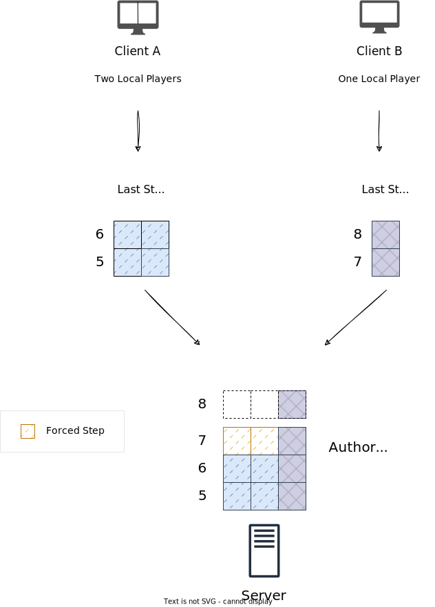

Nimble Server Library

Copyright (C) 2022 Peter Bjorklund. All rights reserved.

== Nimble Server Library

Server functionality for the link:https://github.com/piot/nimble-serialize-c/blob/main/docs/index.adoc[ Nimble protocol]. This library can be used both for a standalone server as well as
for a client hosting a server.

=== Overview

==== Definitions

* Frame - A fixed period of time, usually 16 ms (62.5 Hz). A frame is also known as a tickId.
* Step - The human player input for a Frame (tickId). A step is a set of controls (buttons, analog sticks, etc) that are sent from the client to the server.
* Forced Step - A Zero Step inserted by the server, for Participant Connection Steps that did not arrive on time.
* Participant - A reserved space for a participating player in the game. A client can have multiple Participants in the case of a splitscreen game. A participant is sometimes called a player slot.
* Participant Connection. An array of assigned player slots for a given connection.

==== Server

When a client that wants to participate in the game, it sends a request for a participant connection. The requests holds the number of local human players that are sharing that connection. It can be multiple local players in the case of a splitscreen game.
The server allocates a participant connection and allocates a Participant for each of the local players. A Participant Step Slot can be
filled with one Step per Frame.
When a client joins, it receives a complete snapshot of the simulation state. Notice that no presentation information is present in that state. It is up to each client to render the simulation state in a way that is appropriate for the client.

==== Authoritative Steps

When the server has a few received Steps in the buffers for all the Participants or if one or more clients are ahead of others, it creates an authoritative step.
The Authoritative Steps are then sent as a response to a client requesting to insert new predicted Steps.

If the server notices that one or more clients are ahead of others (more than the acceptable latency-difference between clients, usually around 2-3 ticks), it can no longer wait for those "lagging" Steps to be received. The server then inserts a Forced Step for all steps that are behind. The Forced Step is a "Zero Step", with zero octet count.
It is up to the application to interpret what happens on zero steps, usually it is to not apply any input to the avatar for that tick.

The Forced Zero Step will likely result in a mis-prediction for the avatar assigned to that Participant that missed to insert its own predicted Step.

Keep in mind that the client is aware of how much they are behind in their Step buffer on the server, as well as the latency between the client and server. The client will adjust and will try to predict more Steps further into the future to compensate, and, if needed (to avoid high CPU utilization), enforce a limit on how far it predicts the actual simulation. This will create a local delay for those Steps, but it is a good trade-off.

=== Usage

==== Initialize

Initialize the `NimbleServer` struct. The `memory` and `blobAllocator` are used for allocating memory,
see link:https://github.com/piot/imprint[Imprint] for more information about memory allocators.

[source,c]
----
int nimbleServerInit(NimbleServer *self, struct ImprintAllocator* memory,
                struct ImprintAllocatorWithFree* blobAllocator);
----

==== Feed client data

Main function is `nimbleServerFeed` where you feed the received data from the client with its connectionIndex.
Responses are sent using the transport inside `NimbleServerResponse`.

[source,c]
----
int nimbleServerFeed(NimbleServer *self, uint8_t connectionIndex,
                  const uint8_t *data, size_t len, NimbleServerResponse *response);
----

==== Report client disconnects

[source,c]
----
int nimbleServerConnectionDisconnected(NimbleServer* self, uint8_t connectionIndex);
----
